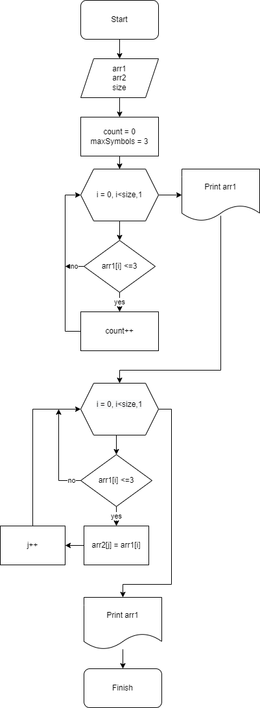

1. Создать репозиторий на GitHub
2. Нарисовать блок-схему алгоритма (можно обойтись блок-схемой основной содержательной части, если вы выделяете её в отдельный метод)
3. Снабдить репозиторий оформленным текстовым описанием решения (файл README.md)
4. Написать программу, решающую поставленную задачу
5. Использовать контроль версий в работе над этим небольшим проектом (не должно быть так, что всё залито одним коммитом, как минимум этапы 2, 3, и 4 должны быть расположены в разных коммитах)

Задача: Написать программу, которая из имеющегося массива строк формирует новый массив из строк, длина которых меньше, либо равна 3 символам. Первоначальный массив можно ввести с клавиатуры, либо задать на старте выполнения алгоритма. При решении не рекомендуется пользоваться коллекциями, лучше обойтись исключительно массивами.

Примеры:
[“Hello”, “2”, “world”, “:-)”] → [“2”, “:-)”]
[“1234”, “1567”, “-2”, “computer science”] → [“-2”]
[“Russia”, “Denmark”, “Kazan”] → []

Решение:

Выводим запрос на ввод количества элементов массива(size).
Пользователь заполняет массив с клавиатуры.
Задаем массив arr1 размером size.
Задаем переменную i (индекс элемента).
Вводим переменную count (счетчик элементов подходящих под условие).
Выводим на экран полученный массив arr1.
Вводим переменную maxSymbols (максимально допустимое количество символов в элементе). По условию maxSymbols = 3.
Вводим элементы массива начиная с первого arr1[0], до тех пор, пока индекс [i] меньше длины массива size, прибавляя по одному.
Каждый элемент массива проверяем по условию: длинна элемента arr[i] <= maxSymbols. Если условие соблюдено, увеличиваем count на один. Если нет - переходим к проверке следующего элемента массива arr1[i+1].
Заполняем новый массив arr2 в пределах цикла. Для этого повторно проводим проверку каждого элемента массива, чтобы длина элемента arr1[i] была больше или равна maxSymbols. Если условие соблюдено, элементу arr2[j] присваиваем соответствующее значение элемента arr1[i]. Записываем его в массив arr2. Если нет, переходим к проверке следующего элемента arr1[i+1].
Выводим полученный массив arr2 на экран.

